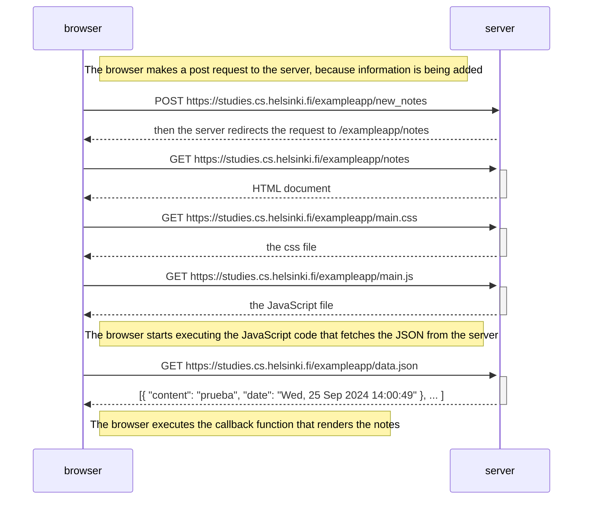

1- El navegador envía una solicitud POST al servidor:

* El navegador envía una solicitud POST con la nueva información (como los datos de un formulario) al servidor.  

2- El servidor actualiza los datos y redirige a la URL de notas:

* El servidor procesa la solicitud, actualiza los datos y luego redirige la URL a /exampleapp/notes para mostrar las notas actualizadas.
El navegador realiza una solicitud GET para obtener el HTML:

El navegador, siguiendo la redirección, realiza una solicitud GET para obtener el documento HTML de la página /exampleapp/notes. El servidor responde enviando el archivo HTML correspondiente.

3- El navegador solicita los archivos CSS y JavaScript:

* Después de recibir el HTML, el navegador envía solicitudes GET adicionales para obtener los recursos vinculados, como el archivo CSS (/exampleapp/main.css) y el archivo JavaScript (/exampleapp/main.js). El servidor responde enviando estos archivos.   

4- El navegador obtiene el archivo JSON actualizado:

* Finalmente, el navegador envía una solicitud GET para obtener el archivo JSON actualizado (/exampleapp/data.json), que contiene los datos de las notas. El servidor responde enviando el archivo JSON con la información actualizada.

```
the way requests and responses are initiated is as follows.

- [https://studies.cs.helsinki.fi/exampleapp/new_note](https://studies.cs.helsinki.fi/exampleapp/new_note)
- [https://studies.cs.helsinki.fi/exampleapp/notes](https://studies.cs.helsinki.fi/exampleapp/notes)
- [https://studies.cs.helsinki.fi/exampleapp/main.css](https://studies.cs.helsinki.fi/exampleapp/main.css)
 - [https://studies.cs.helsinki.fi/exampleapp/main.js](https://studies.cs.helsinki.fi/exampleapp/main.js)
 - [https://studies.cs.helsinki.fi/exampleapp/data.json](https://studies.cs.helsinki.fi/exampleapp/data.json)
```


