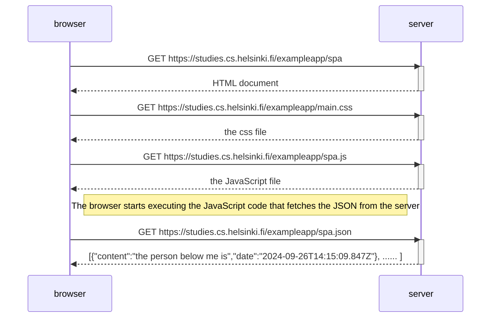

1- Petición inicial al servidor (HTML):

* El navegador envía una solicitud GET al servidor para obtener el documento HTML desde https://studies.cs.helsinki.fi/exampleapp/spa.
* Resultado: El servidor responde con el documento HTML necesario para la aplicación.
* Activación/Desactivación: El servidor se activa para procesar la solicitud y se desactiva tras responder.

2- Petición del archivo CSS:

* Después de recibir el HTML, el navegador detecta que necesita un archivo CSS (main.css) para estilizar la página.
* El navegador envía otra solicitud GET a la URL https://studies.cs.helsinki.fi/exampleapp/main.css.
* Resultado: El servidor responde con el archivo CSS que contiene las reglas de estilo de la aplicación.

3- Petición del archivo JavaScript:

* El navegador también detecta que el HTML requiere un archivo JavaScript (main.js) para ejecutar la lógica interactiva de la aplicación.
* Se envía otra solicitud GET a la URL https://studies.cs.helsinki.fi/exampleapp/main.js.
* Resultado: El servidor responde con el archivo JavaScript necesario para la SPA.

4- Ejecución del código JavaScript en el navegador:

* Una vez que el navegador recibe y carga el archivo JavaScript, comienza a ejecutarlo. Parte de esta ejecución implica la recuperación de datos en formato JSON desde el servidor para mostrar contenido dinámico.

5- Petición del archivo JSON:

* El JavaScript en ejecución realiza una solicitud GET al servidor para obtener los datos de la URL https://studies.cs.helsinki.fi/exampleapp/spa.json.
* Resultado: El servidor responde con un archivo JSON que contiene una lista de notas con su contenido y fecha.
El JSON incluye datos como: {"content":"the person below me is","date":"2024-09-26T14:15:09.847Z"} y más.
```
the way requests and responses are initiated is as follows.

The requests initiator chain looks as follows:

https://studies.cs.helsinki.fi/exampleapp/spa
  https://studies.cs.helsinki.fi/exampleapp/main.css
    https://studies.cs.helsinki.fi/exampleapp/spa.js
      https://studies.cs.helsinki.fi/exampleapp/data.json
```


