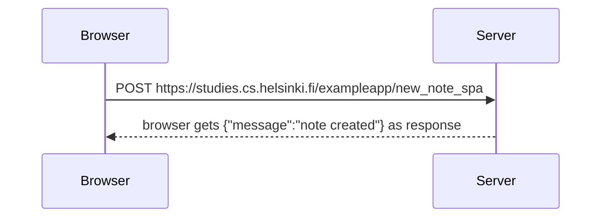

1- El navegador envía una solicitud POST al servidor:
* El navegador realiza una solicitud HTTP de tipo POST al servidor, específicamente a la URL https://studies.cs.helsinki.fi/exampleapp/new_note_spa.
* Esta solicitud incluye datos en el cuerpo de la solicitud (como el contenido de la nota que el usuario ha escrito).

2- El servidor recibe la solicitud:
* El servidor recibe la solicitud POST del navegador.
* Procesa los datos enviados por el navegador (es decir, la nota que se va a crear).

3- El servidor crea la nota:

* El servidor toma los datos de la solicitud (la nota) y los guarda en la base de datos o el almacenamiento correspondiente.

* Después de crear la nueva nota, el servidor prepara una respuesta.

4- El servidor responde al navegador:

* Una vez que el servidor ha creado la nota con éxito, responde al navegador con un mensaje en formato JSON.

* Este mensaje tiene la estructura: {"message":"note created"}, lo que le indica al navegador que la nota ha sido creada correctamente.

4- El navegador recibe la respuesta:

* El navegador recibe la respuesta del servidor.

* Dependiendo de cómo esté configurada la aplicación, puede realizar una acción en la interfaz de usuario (como mostrar una notificación de éxito o actualizar la lista de notas).